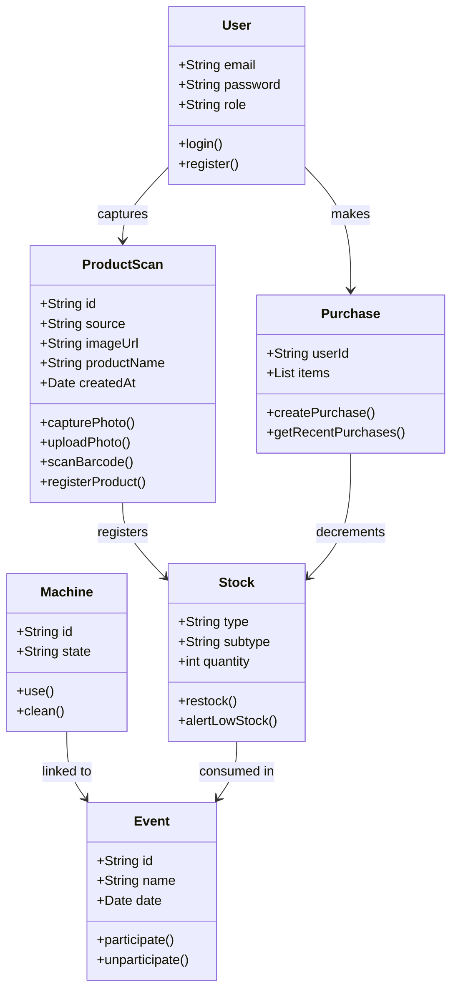

# UML Class Diagram

Ce diagramme représente les principales classes de l'application et leurs relations :

```mermaid
classDiagram

class User {
  +String email
  +String password
  +String role
  +login()
  +register()
}

class Stock {
  +String type
  +String subtype
  +int quantity
  +restock()
  +alertLowStock()
}

class Purchase {
  +String userId
  +List items
  +createPurchase()
  +getRecentPurchases()
}

class Machine {
  +String id
  +String state
  +use()
  +clean()
}

class Event {
  +String id
  +String name
  +Date date
  +participate()
  +unparticipate()
}

class ProductScan {
  +String id
  +String source
  +String imageUrl
  +String productName
  +Date createdAt
  +capturePhoto()
  +uploadPhoto()
  +scanBarcode()
  +registerProduct()
}

User --> Purchase : makes
User --> ProductScan : captures
ProductScan --> Stock : registers
Purchase --> Stock : decrements
Machine --> Event : linked to
Stock --> Event : consumed in
```